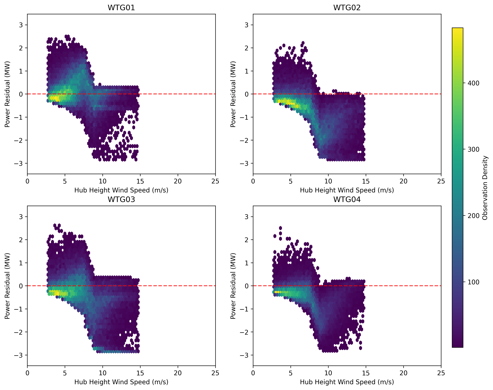
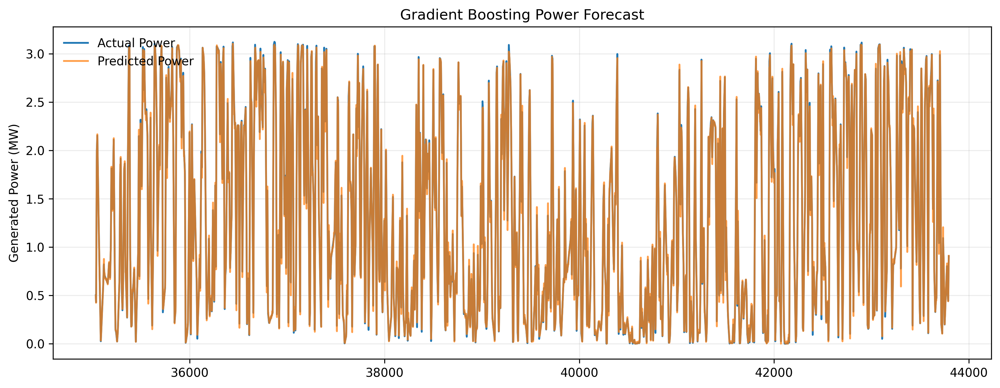

# wind-turbine-performance-analysis-and-forecasting
Wind turbine SCADA Analysis | Power curves, KPI dashboard, loss analysis, and forecasting

# Wind Turbine Performance Analysis

## Overview

This project presents an analysis of wind turbine SCADA data, focusing on performance monitoring, loss identification, and data-driven insights for renewable energy assets.

---

## Objectives

* Analyse wind turbine performance using SCADA data
* Generate and evaluate power curves
* Identify and quantify curtailment losses
* Develop key performance indicators (KPIs)
* Visualise turbine and fleet-level performance
* Explore basic forecasting techniques

---

## Dataset

* Source: Kaggle Wind Turbine SCADA Dataset
* Data includes:

  * Wind speed (10m and 100m)
  * Wind direction (10m and 100m)
  * Power output (normalised)
  * Some temperature and environmental variables

---

## Key Analysis

### Time Series Analysis

* Fleet and turbine-level generation trends
* Rolling averages (3-day smoothing)
* Curtailment overlay

### Power Curve Analysis

* Scatter and hexbin power curves per turbine
* Modelled expected power curve
* Residual analysis to detect underperformance

### Loss Analysis

* Curtailment detection and quantification
* Energy loss estimation per turbine

### Wind & Directional Analysis

* Wind roses per turbine
* Power roses for directional performance

### KPI Development

* Annual Energy Production (AEP)
* Capacity Factor
* Performance Ratio
* Curtailment Loss (%)
* Wind-adjusted availability (proxy)

### Forecasting

* Wind speed forecasting using ARIMA model
* Checks for viability of SARIMA model
* Forecasts for power and wind speed using Gradient Boosting models

---

## KPI Dashboard

A consolidated KPI dashboard was developed to provide:

* Fleet-level performance overview
* Turbine comparison
* Identification of underperformance and losses

---

## Sample Visuals




---

## Tools & Technologies

* Python (Pandas, NumPy)
* Matplotlib
* Scikit-learn
* Statsmodels
* Windrose

---

## Project Structure

```
data/
notebooks/
src/
visuals/
README.md
requirements.txt
```

---

## Future Improvements

* Short-term forecasting using persistence
* Long-term forecasting using a synthetic data set and Gradient Boosting models

---

## Author

Liam Abrahams
Mechanical Engineer | Renewable Energy | Data Analytics

